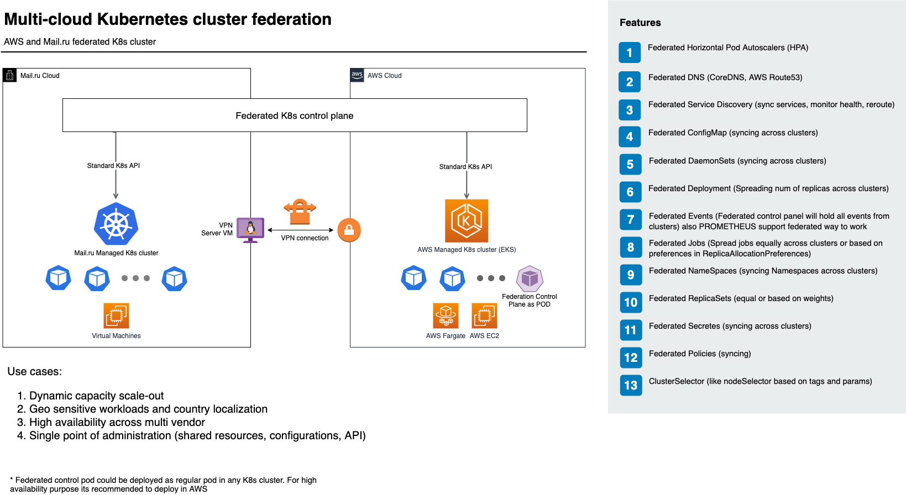

# Kubernetes cluster Federation between Mail.ru Cloud and AWS
This project automates the deployment and configuration process of the demo stand. The main purpose of this deployment is to demonstrate the work of federation between two clusters: AWS EKS (Elastic Kubernetes Service) and Mail.ru Cloud Managed Kubernetes service through a secured VPN connection. Federation is done using the official Kubernetes [kubefed project](https://github.com/kubernetes-sigs/kubefed). We see these scenarios that could benifit from cluster federation but not limited to them:
* Dynamic scaling between clusters
* Helping to arrange Geo/Country sensitive workloads and hybrid architectures
* High availability between clusters/clouds
* Single point of administration for multiple clusters across regions or clouds

## Architecture of deployment
<p align="center"></p>

## How to deploy using prepared Docker image

This image is intended for usage in interactive mode.

### Step 0: Create image

```bash
docker build -t aws-mcs-k8s-federation .
```

### Step 1: Run container

```bash
docker run -it aws-mcs-k8s-federation /bin/bash
```

OR

```bash
docker run -d aws-mcs-k8s-federation
docker exec -it <container ID> /bin/bash
```

### Step 2: Configure AWS credentials

This step may be skipped, if on host machine you have configured credentials in `~/.aws` and during container run you've mounted them, e.g. `-v $HOME/.aws:/root/.aws`. Credentials are expected to be in `/root/.aws`. Otherwise, configure them during interactive mode:

```bash
aws configure
```

### Step 3: Configure MCS credentials

Again as in AWS, this step may be skipped, if a correct mount is provided during container run, e.g. `-v $HOME/my-openrc.sh:/app/openrc`. Credentials are expected to be in file `/app/openrc`. See [help](https://mcs.mail.ru/help/iaas-api/openstack-api). It is highly recommended to have the password in there, instead of an interactive request, e.g. `export OS_PASSWORD="mypass"`.

If you've already have running container, copy the file during interactive mode:

```bash
cat > /app/openrc

<PASTE YOUR OPENRC>

Ctrl+D
```

### Step 4: Run the main script

Main script is `super-big-script.sh`.

```bash
./super-big-script.sh
```

### Outputs

After the script has finished, you'll have plenty of files needed for later work **inside** the container. To mitigate possibility of losing them, it is recommended to copy them somewhere **outside** the container.

* MCS Keypair with name `k8s-fed-XXXX` will be created. Private part will be stored in `/var/tmp/k8s-fed_id_rsa`. It should be used to access VPN server and Kubernetes nodes by SSH.
* MCS KUBECONFIG with private IP will be stored in `/var/tmp/mcs_k8s_cfg`. This is not so critical, because may be reacquired from MCS console or API.
* AWS EKS KUBECONFIG updated to conform to `kubefedctl` tool. This is stored in `/root/.kube/config`.
* AWS VPN configuration is stored in `/var/tmp/vpn_cfg_conn.xml`.

### Check that the federation is working 
In docker container execute this command:
```bash
 kubectl -n kube-federation-system get kubefedclusters
```
You should see something like this in the output:
```bash
NAME               READY   AGE
awsfedcluster      True    30s
mcs-cluster-42k4   True    24s
```
